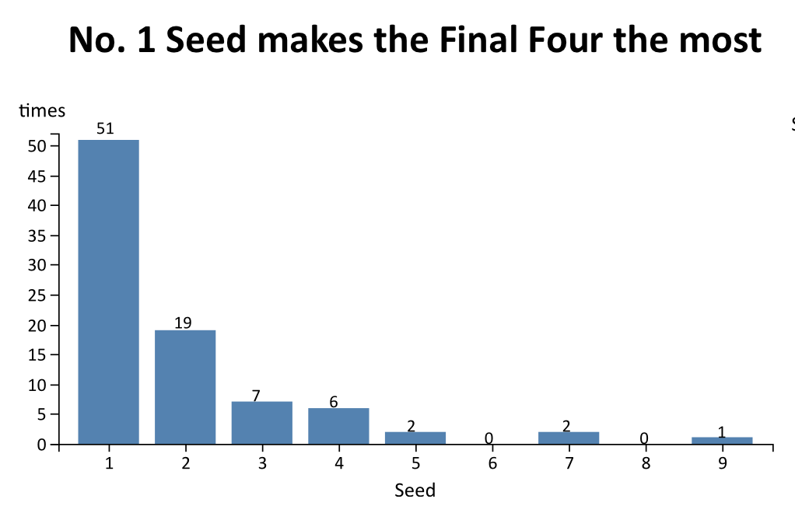

## Introduction:
### Title: NCAA Women's Basketball: Seeds and Results

NCAA women's basketball tournament is an annual college basketball tournament for women. 
The tournament is split into four regional(X, Y, W, Z) tournaments, each regiona has teams seeded from 1 to 16. 
No. 1 Seed is considered as be best team in the region, No. 2 Seed is the second best team in the region, and so on.

Each year, Google Cloud and the NCAA release a competition on kaggle.com, invite Kagglers to predict the result of the tournament. 
I saw this competition when I prepare my infomation visualization project, and learned a lot about NCAA. 
I found seeding is very important when filling out brackets. It is likely the only relevant data that a person has on a team. 
So I chose this topic.

In this project, I will use a couple of charts to show how seeds matter to the result of NCAA women's basketball based on data from season 1998 to 2019.

Project link: https://www.cs.odu.edu/~ydeng/cs725/Project/

## Data Description and Process:
### Data Source: 
Data is retrived from kaggle competition "Google Cloud & NCAA® ML Competition 2019-Women's[1]", the link is https://www.kaggle.com/c/womens-machine-learning-competition-2019/data
But the data from kaggle doesn't provide game results for season 2019, so I got this part of data from the official site of NCAA: https://www.ncaa.com/brackets/basketball-women/d1/2019

### Data Description:
There are 11 csv files in the kaggle competition, 3 are used in the project. WNCAATourneySeeds.csv provides the seeds for all teams in each NCAA tournament season from 1998 to 2019.
But it only provides Seed, TeamID, no Team Name. So I need to use WTeams.csv to connect Seed and Team. WNCAATourneyCompactResults.csv identifies the game-by-game NCAA tournament results for all seasons frome 1998 to 2018.
This is the most important dataset I used to obtain the seed information for each game. As I mentioned earlier, I retrive the game results of season 2019 from the official site of NCAA.

### Data Process:
I generated seven datasets based on the original datasets for this project. The first one is final4.csv, this dataset shows which seed made the Final Four in each season. 
There are 6 columns in final4.csv: season, seedno, result, teamID, teamName, region. In column "result", there are 3 different values. 
1 indicates the champion of this season, 2 represents the second place of the season. 3.4 means the teams who lost in the final four of that this season.
Because there is no match for the third place, so I use 3.4 to indicate teams who didn't get a chance to the Finals.

The second dataset is seedtime.csv. This is an aggregated dataset. It shows how many times has each seed made the Final Four during 1998 to 2019.
I generate seedtime.csv with final4.csv. There are only two columns in this file: seedno, times. Each row of the data shows the times this seed made to final four in all seasons from 1998 to 2019.

The third dataset is round.csv, this is also an aggregated dataset. It shows the percentage of seeds remaining in each round of tournament of all seasons from 1998 to 2019.
I use Season, DayNum, WTeamID, LTeamID of WNCAATourneyCompactResults.csv and the official site of NCAA to generate this dataset.  There are 3 columns in round.csv: round, seed, percentage. 
Each row represents the percentage of the seed remaining in the particular round. There are seven possible values in column round: Rnd of 64, Rnd of 32, Sweet 16, Elite 8, Final 4, Finals, and Champion.
 
Since seed is very important in NCAA women's basketball tournament, I'd like to see how did the seed changed for each team during the past seasons. 
So I generated the last three datasets, t1.csv, t2.csv, t3.csv based on WNCAATourneySeeds.csv and WTeams.csv. t1.csv has teams with best seeds(#1-#4). 
t2.csv has teams with middle seeds(#5-#9). t3.csv has teams with the lowest seeds(#10-#17). I treat No. 1 seed to No. 4 seed as top seeds because most seeds made to the Final Four are seeds from No. 1 to No. 4. 
There were no seeds from No. 10 to No. 17 made to the Final Four, so I treat No. 10-No. 17 as low seeds. The rest seeds(#5-#9) are considered as middle seeds.

Since there are 64 teams attend the tournament each season. If I show all teams' seed journey, it will be too much for the visualization. 
So I chose 30 teams of season 2019 to show. To avoid losing information about the seed changing trend, I observe the seed journey of the 64 teams of season 2019 first,
and then chose teams that can represent most information about seed changing trend. 

## Visualization:

I use four charts to show how seeds matter to the result of NCAA women's basketball.

To give users a basic idea how important seed is, I use a scatterplot(Fig.1) to show which seed made the Final Four in each season first. 
In the scatterplot, the biggest gold dot means the champion of the season. The middle sized silver dot indicates the second place of the season. 
Blue dots represents 3rd or 4th place of the season. When mouseover a dot, it will show a tooltip with information of the team's name, team's region and team's ID.

*Fig.1: Scatterplot shows which seed made final four for each season from 1998 to 2019.*

From the chart we can see, only No. 1 seed and No. 2 seed won during the past 22 seasons. Top seeds made to the Fianl Four in most cases. 
There is only one time that team with a 9 seed made to the Final Four. Teams with low seeds(#10-#17) never made to the Final Four.

The first chart only give us a basic idea that teams with top seeds easily made to the Final Four. 
But there is no exact statistics shown in the chart. So I generate a histogram(Fig. 2) to show the times that each seed made to the Final Four during 1998 to 2019. 
There is a number on top of each bar which shows the exact number that the bar indicates. 

*Fig.2: Histogram shows the times that each seed made to final four during 1998 to 2019.*

From the visualization we can see more clearly that in most cases, No.1 seed will make to the Final Four. There is a sharp drop down for No.2 seed. 
The number keep reducing as the seed increasing.

The first two charts only show information about the Final Four, but how about each round of the tournamment? How does seed affect with results of each round of the game?
To answer this question, I generate the third chart(Fig. 3) which shows the percentage of seeds remaining in each round of tournament of all seasons from 1998 to 2019.
This chart combines stacked bar chart and slope graph together. The sub-bar of each bar is ordered by percentage from top to bottom.
When mouseover a sub-bar, it will show a tooltip with information of the seed, and the percentage of the seed that remaining in the particular round.

*Fig.3: Stacked bar chart shows the percentage of seeds remaining in each round of tournament of all seasons from 1998 to 2019.*

From this chart we can see that teams with top seeds have larger percentage of each round than teams with low seeds. 
Especially for No. 1 seed, the percentage is become bigger and bigger for each round of the tournament.

From the previous charts, we can see that seeds are very important to NCAA women's basketball tournament. 
So I generate a small mutiple(Fig. 4) at last to show the seed difference from year to year of each team. There are three multiple line charts in this small multiple.
Multiple line charts from left to right, repectively show seed journey for top seeds(#1-#4), middle seeds(#5-#9), and low seeds(#10-#16) during the past 10 seasons.
When mouseover a line, it will show the team name.

*Fig.4: Small multiple shows seed changing history for teams attended this season's(2019) NCAA tournament.*

From the small multiple we can see that team with top seeds(#1-#4) often get top seeds during past few years. But there are exceptions, such as team Oregon, 
which has sharp increase in seed in season 2016. If we search the history of team Oregon we can find out that the change their coach to Kelly Graves in 2014[18]. 
This might be the reason that the team become strong suddenly. Same thing happened to team South Carolina, they change their coach to Dawn Staley in 2008[19], three years later, they become No. 5 seed.

Teams with middle seeds(#5-#9) fluctuate a lot. Teams with low seeds(#10-#17) always get low seeds, even didn't get a chance
to attend the NCAA in some seasons. But there are also exceptions, such as team Tennessee, which has a top seed before 2015 and had a sharp drop in seed in 2016.
As we all know, the coach for team Tennessee Pat Summitt received a diagnosis of early-onset Alzheimer's disease.[20] So she retired in 2012. 
A few years later, Seed of Tennessee drops sharply. 

To sum up, seeds matter a lot to NCAA women's basketball. In most cases, team's seed fluctuate in a controllable range. There are some exceptions that a few teams had a sharp increase/drop in seed in consecutive years.

## Design Decisions:

To show how seeds matter to the result of NCAA women's basketball,  I decide to show which seeds made to the Final Four for each season first. 
Scatterplots are the canonical example of showing two value attributes.[2] So I decide to use a scatterplot as the first chart.
In the scatterplot, people can only see which seed made to the Final Four for each season. But for a particular seed, how many times it made to the Final Four during the past 22 seasons are now clear. 
So I design a histogram to show this information. In the first two charts, information about final four is well delivered. 
But there is no information about other rounds of the tournament. So I design a stacked bar chart to show the percentage of seeds remaining in each round.
From the first three charts we can see seeding is very important in NCAA tournament. So I design a small multiple, Seed Journey (2010-2019), to show the seed difference from year to year.
From the small multiple, user can get information about teams that often get the same seed or teams that had a sharp increase or decrease in seed.

### Chart 1 - Top seeds always make the Final Four: 

This is a scatterplot. The "item" shown in this chart is team. The marks in this chart are point and line, channels are horizontal position, vertical position, color,and area.

I use horizontal position to show the order of season. Because season is an ordered attribute. Vertical position is used to show the order of seed. 
Unlike normal coordinate graphs，in this chart No. 1 seed is on top, No. 16 seed is at bottom. 
I made this decision because in NCAA tournament, No. 1 seed indicates top seed which means the team is considered as a strong team.
While No. 16 seed is a low seed. Teams with low seeds are considered having poor skill. So I put 1 at the top to show that team with a top seed has a better skill.

To show more information about the Final Four, I use color to indicate the results of each season. 
Gold means the team is the champion of this season. Silver means the team is the second of this season.
Blue means this team were in the Final Four, but not in the Finals of the season. 
I choose blue because it is consistent with the whole visualization. The main color scheme of this visualizatino is blue.
Color lengend is used at the bottom right to indicate the meaning of each color.

Besides color, I also use area to indicate the results of each season. The biggest dot means the team is the champion of this season. 
The second biggest dot means the team is the second of this season. The smallest dot means this team was in the Final Four, but not in the Finals of the season.
Another reason I use area is because there are some cases that there are more than one seed made to the Final Four in a particular season. 
Using area channel and putting smaller dot over larger dot can avoid most cases of dots overlapping. 

Line mark is used here to help users easily get the seed and season information for each dot. 
In most cases, only top seeds made to the Final Four. As I illustrate early I put top seed on top of y-axis(seed).
So it is hard for user to see the season of each dot without a grid. Because position is the best effective channel. 
It is easier for user to observe which seed and season each dot belongs to when there is a line that connects the dot to both axises.

I also create a tooltip for the scatterplot. When mouseover each dot, it will show the information of the team name, team region and team ID. 
So user can get more information about the team if they want to.

### Chart 2 - No. 1 Seed makes the Final Four the most:

As I learned in the text book, histogram is used to show the distribution of items within an original attribute.[2] 
So I generate a histogram here to show how many times each seed made to the Final Four during the past 22 seasons.
The "item" shown in this chart is seed. I use line as the mark, and horizontal position, vertical position, and length are channels.

I use horizontal position to show the order of seed. Vertical position is used to show the ranking of times that each seed made to final four. 
Because aligned spatial position is the best effective channel to show ranking. Length of the bar is also a channel to show the ranking of times.
I also add a number above each bar. So user can know the exact times that each seed made to the Final Four.

### Chart 3 - How far can each seed go?:
I use stacked bar chart as the main design of this chart, because stacked bar chart can show items with two keys. 
In this chart, round is one key, seed is another key. Each bar indicates each round, such as round of 64, round of 32, Sweet 16, etc. 
Each bar is divided into a couple of small sub-bars. Each sub-bar shows the percentage of the seed remaining in the round of tournament of all seasons from 1998 to 2019.
All the sub-bar is ordered by height with the longest bar on top, shortest bar at bottom.

I also combine slope graph together with the stacked bar chart. Since all the sub-bar is ordered in each bar. 
With the connecting line user can see the percentage ranking changing trend for each seed clearly.

In this chart, mark is line, channels are horizontal position, vertical position, length, color hue and saturation.

I use horizontal position to show the order of each round. 
One special case is the last bar (champion), it is not a round of the tournament but the final result of the tournament. 
But I think it is good to include it in this chart. So users can also see the percentage that each seed win the tournament.

I use vertical position to show the order of percentage.  Seed with a higher percentage in each round will have a sub-bar at a higher position. 
Unaligned spatial position is the second effective channel for ordered attributes. 
Combining with the color channel and the link between each sub-bar, it is pretty clear of the ranking changing trend for each seed.

Length is another channel to show the ranking of percentage. Length is the third effective channel for ordered attributes.
Especially for rounds like the Final Four, Finals. It is obvious that No. 1 seed has the hightest percentage. 

I use color hue and saturation together to indicate different seed instead of only use color luminance/saturation in this case, even though there is an order of the seed.
I made this decision because the discriminable steps for luminance is only 5, 3 for saturation, and 6-7 for hue. But we have 16 seeds. 
It would be hard to distinguish different seeds if I only use hue, luminance or saturation. So I treat the seed as categorical attribute, and combine hue and saturation together to indicate each seed.
Color combine with the link which connect each seed between each round / bar make the chart effectively show the Seed Advancing information.

I also create a tooltip for this chart. When mouseover each sub-bar, it will show the information of the seed, and the percentage of the seed that remaining in the particular round. 
So user can get more information if they want to.

### Chart 4 - Seed Journey (2010-2019):

Small multiple is used to show different partitions of the dataset. With a small multiple, user can compare the differences between each view easily.[2]
I want to show the seed difference from year to year. By observing the data, I found that team with top seed(#1-#4) often get top seeds during past few years. 
Teams with middle seeds(#5-#9) fluctuate a lot. Teams with low seeds(#10-#17) always get low seeds, even didn't get a chance to attend the NCAA in some seasons. 
So I chose small multiple to show the seed jouney for different seed level. 

For each chart in the small multiple, I generate a multiple line chart.
Line chart implies a trend which can be used for ordered keys. It is perfect to show the the seed journey of each team through different season.
Because I want to show a couple of teams for each seed level. So I chose multiple line chart for each small multiple. Each line in the chart represents a team.

The most important decision I made for this chart is how many team I want to show in the small multiple.
If I show all teams' seed journey, it will be too much for the visualization. Because there are 64 teams attend NCAA each season.
At first I decide only show seed journey for teams attend the 2019 season. But there will still be more than 20 lines in each line chart. 
Also small multiples has a limitation based on the display resolution. So I cannot show all 64 teams in this chart. 
Therefore, I chose 30 teams of season 2019. To avoid losing information about the seed changing trend, I observe the seed journey of the 64 teams of season 2019 first,
and then chose teams that can represent most information about seed changing trend. So In the final implementation, user can see the main trend for each seed level, and some exceptions as well.

In this chart, team is the item. Line is the mark. Horizontal position, vertical position, color are the channels.

I use horizontal position to show the season. Horizontal position is also used to differenticate the three multiple line charts which are positioned from left to right.
Vertical position is used to show the seed. As I illustrated in chart 1, I put No. 1 seed at top of the y axis because it indicates the strongest team.

I use color to indicate each team. Color is the second effective channel to show categorical attribute. In each multiple line chart of the small multiple, I have 8 to 12 lines.
For multiple line chart that has 12 lines, user might be overwhelmed by the lines and their color, because the discriminable steps for hue is 6-7. 
But the main goal of this chart is to compare these three multiple line charts. So user can see the seed changing trend for each seed level. 
The color do not affect the goal of the chart. When implement the visualization, I also create a black multiple line chart to decide if I should use the color channel.
Compare the following charts, I found out that the black multiple line chart make it even harder to observe each line. So I decide to use color channel.

I also create a tooltip for this chart. When mouseover each line, it will show the information of the team name. 
Another reason to use tooltip is I didn't use color lengend for this chart due to the display resolution limitation. So user can get more information about each line with the tooltip. 

Another decision I made for this chart is how to represent the seed if a team didn't attend the NCAA in some season. 
Especially for low seed teams, they seldomly get a chance to be selected to NCAA tournamant. 
So I use 17 as the seed of team who didn't attend NCAA in a season.
In the multiple line chart, this seed will be on the x - axis and under the vertical position of seed 16. 
So users can tell that this is the case that the team didn't attend NCAA during that season. 

Lastly, due to the display resolution limitation, I only show the seed journey from season 2010-2019. 
This is different from the first three charts which all include information from season 1998 to 2019.

## Development Process:

I didn't spend a lot of time on the first two charts. The code for these two charts are based upon scatterplot and bar chart I created for HW3 and HW4.
The main challenge part of the first chart is the grid. I searched the grid code online[3], and change it to fit with my data. I used about 2 hours for this part.

The third chart is the most challenge part for the whole project. I used a whole day to construct this chart.
I searched online and find code for "d3 stacked bar bump chart"[4]. But it is in D3V4. I first changed it to make it fit with my data based in D3V4, and then debug step by step to make it work for D3V5. 

The small multiple is also a challenge part for this project. I spent almost a whole day to construct this chart.
I first found a multiple line chart code of D3V4, and change it for my data. But when I change it to D3V5, it didn't work. I couldn't figure out how to solve the problem.
So I searched again and find code of multiple line chart of D3V5.[5] Change it to make it fit for my data.

## References:
1. NCAA Division I Women's Basketball Tournament: https://en.wikipedia.org/wiki/NCAA_Division_I_Women%27s_Basketball_Tournament
*  Visualization Analysis & Design, Tamara Munzner
*  Adding grid lines to a d3.js graph: http://www.d3noob.org/2013/01/adding-grid-lines-to-d3js-graph.html
*  d3 stacked bar bump chart: https://bl.ocks.org/dawaldron/df07e00da18115300f929e8c1a7d4ff7
*  Responsive Multi-Line Chart: https://gist.github.com/zischwartz/2206230da01250355565e65d4f3d58c4#file-giniline-csv
*  S19 - HW 3 - Bar Chart: https://blockbuilder.org/weiglemc/ea587543ac03afa4f97be8756219b1df
*  S19 - HW3 - Scatterplot: https://blockbuilder.org/weiglemc/0d294bbc84a5d4cf174d6a598f594c88
*  D3 Scatterplot Example: http://bl.ocks.org/weiglemc/6185069
*  NCAA basketball tournament selection process: https://en.wikipedia.org/wiki/NCAA_basketball_tournament_selection_process
*  The History of the Final Four, Visualized http://thedataface.com/2017/04/sports/final-four-visualized
*  NCAA Tournament Seed and Probability of Advancing http://www.bytemuse.com/post/ncaa-tournament-seed-probability-advancing/
*  The persistence of underdogs, part 2 https://datascopeanalytics.com/blog/the-persistence-of-underdogs-part-2/
*  Bracketology: A March Madness Data Visualization: https://www.good.is/articles/bracketology-a-march-madness-data-visualization
*  Journey to the Top https://www.briandevine.net/portfolio/college-basketball-ranking-progression/
*  NCAA Bracket History Visualization https://github.com/andrewsommerlot/ncaa-bracket-history-visualization
*  CloudLines: Compact Display of Event Episodes in Multiple Time-Series https://ieeexplore.ieee.org/document/6065010/
*  The official site of NCAA: https://www.ncaa.com/brackets/basketball-women/d1/2019
*  Kelly Graves https://en.wikipedia.org/wiki/Kelly_Graves
*  Dawn Staley https://en.wikipedia.org/wiki/Dawn_Staley
*  Pat Summitt https://en.wikipedia.org/wiki/Pat_Summitt

